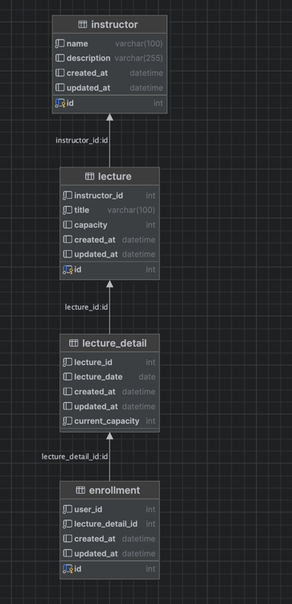

# ERD



## 테이블 설계 근거 

- 모든 테이블의 id는 자동 생성하여 고유성을 보장한다.
```sql
@GeneratedValue(strategy = GenerationType.IDENTITY)
```

### instructor: 강사 정보를 관리하기 위함
- 필수값인 강사의 이름을 강제해서 데이터 무결성을 유지한다.
```sql
    @Column(nullable = false)
    private String name;
```

### lecture: 특강 정보를 관리하기 위함
- 각 특강은 하나의 강사에 속하므로 다대일 관계로 설정했다. 이로 인해 특강-강사 간의 관계를 쉽게 맺을 수 있다.
```sql
    @JoinColumn(name = "instructor_id")
    @ManyToOne(fetch = FetchType.LAZY)
    private InstructorEntity instructor;
```
- 특강 생성 시 필수적인 정보인 제목과 수강 정원 필드는 필수로 설정하여 데이터 무결성을 유지한다.
```sql
    @Column(nullable = false)
    private String title;

    @Column(nullable = false)
    private int capacity;
```

### lecture_detail: 특강의 세부 정보 관리

- 각 특강 세부 정보는 하나의 강좌에 연결되어 있다. 이로 인해 특강의 구체적인 정보를 관리할 수 있다.
```sql
    @JoinColumn(name = "lecture_id")
    @ManyToOne(fetch = FetchType.LAZY)
    private LectureEntity lecture;
```

### enrollment: 유저의 특강 신청 정보 관리

- 특강 신청 정보 생성 시 필수적인 정보인 유저 필드는 필수로 설정하여 데이터 무결성을 유지한다.
```sql
    @Column(nullable = false)
    private int userId;
```

-  특강 신청은 하나의 특강 세부 정보에 연결되므로 다대일 관계를 설정했다. 이로 인해 각 특강 신청이 어떤 특강에 연결되어 있는지 쉽게 확인할 수 있다.
```sql
    @JoinColumn(name = "lecture_detail_id")
    @ManyToOne(fetch = FetchType.LAZY)
    private LectureDetailEntity lectureDetail;
```


- 애플리케이션 레벨에서 user_id와 lecture_detail_id가 중복된 값이 추가되지 않도록 처리 했지만, 추가적으로 데이터베이스 레벨에서도 중복된 값이 추가되지 않도록 유일성 제약 조건을 추가했다.  
```sql
@Table(name = "enrollment", uniqueConstraints = {@UniqueConstraint(columnNames = {"user_id", "lecture_detail_id"})})
```
